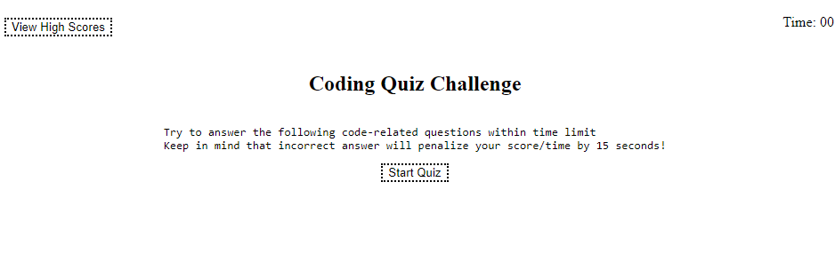
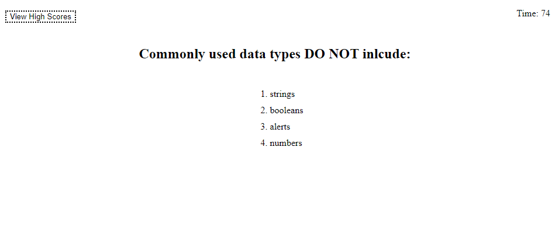
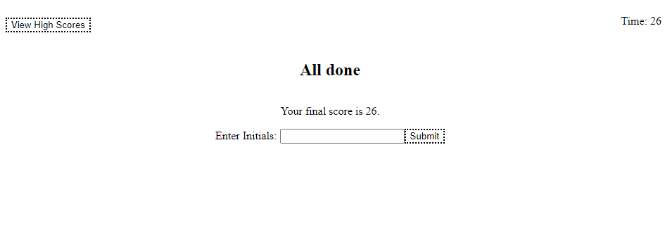
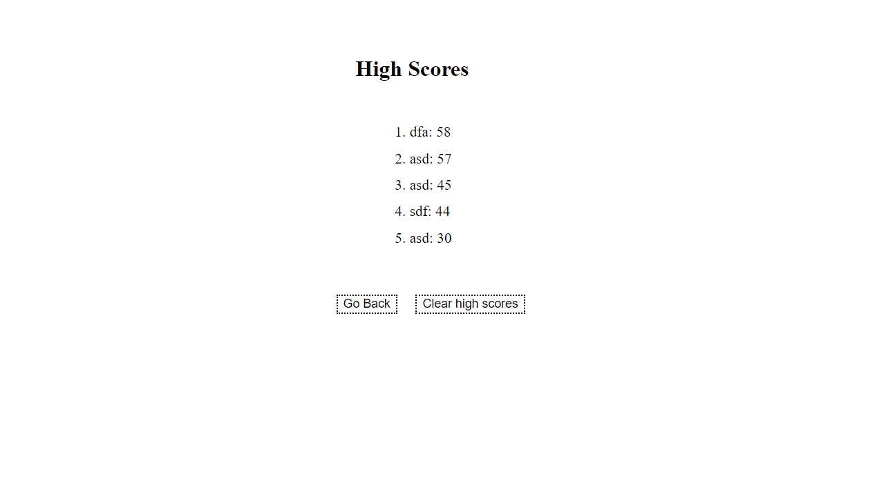

# Challenge #4: Timed Quiz

## Description

The objective of this project is to present a quiz web app to prepare someone before their exam.
I wanted to create this site in part as practice for my understanding fundamentals in frontend developing, as well as provide template for self-testing/refresher material.

Lessons Learned:
There were probably ways to create more concise and succinct functions. Due to limitation on time, I am more prone to side with code that is faster for me create/read/understand and run.

Bugs are always inherent in the process. Give yourself enough time to think and create a plan to solve.

## Installation

None.

## Usage

In your preferred browser, navigate to the url:
<https://github.com/19dbo91/challenge4-timed-quiz>

Begin the quiz by hitting start. The time in the top right will immediately start counting down.

The question will appear on screen and the answers enumerated below it. Click on the answers to progress. You will be presented with more questions until you run out of time or there are no more questions left to answer.

After that you will be presented with a score on how well you did and a space to submit your score to the <b>High Score</b> leaderboard. Click submit to continue.

Once you have submttied your initials, you will see the <b>TOP 5</b> Scores. You can choose to clear the board. Clicking <i>Go Back</i> to start a new round.

<b><i>~ Thanks for playing! ~ </b></i>

## Credits

Regions:

<https://marketplace.visualstudio.com/items?itemName=MadsKristensen.JavaScriptRegions>
 
InnerHTML vs textContent

<https://www.youtube.com/watch?v=1UsllDMhvN4>

Splice

<https://www.freecodecamp.org/news/javascript-splice-how-to-use-the-splice-js-array-method/>

## Features

Javascript written by me with references above to guide me